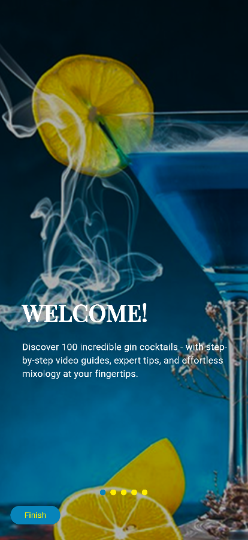
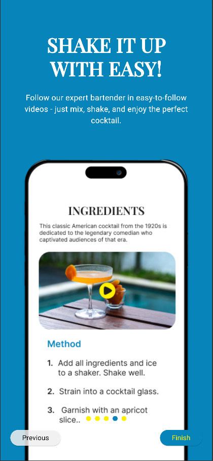
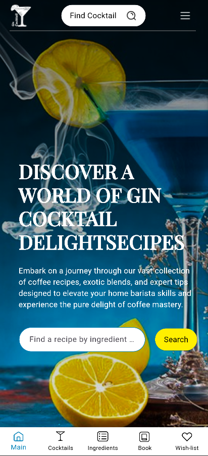
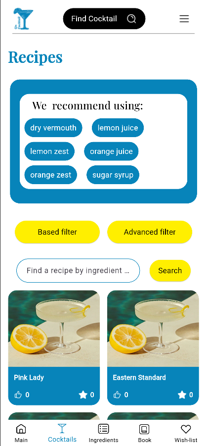
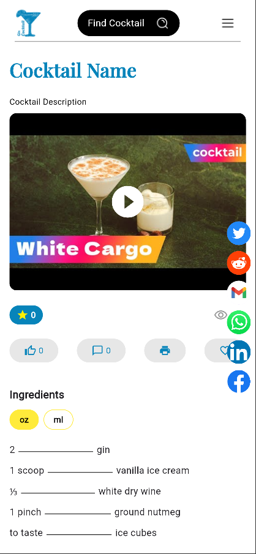

# 🍸 Cocktail Cosmo Design

**Cocktail Cosmo Design** is a mobile app for a cocktail shop that allows users to explore various cocktail recipes, discover ingredients, and get detailed video instructions for cocktail preparation. With support for multiple languages, dark mode, and smooth UI features, the app enhances the experience of cocktail enthusiasts.

---

## 🚀 Technologies & Tools Used

- **Flutter**: The framework used for building the mobile app.
- **Dart**: Programming language for app development.
- **get: ^4.7.2**: State management and navigation.
- **flutter_localizations**: For supporting multiple languages.
- **intl: 0.19.0**: To handle internationalization.
- **adaptive_theme: ^3.7.0**: Support for light and dark themes.
- **dotted_line: ^3.2.3**: Custom dotted line divider.
- **flutter_svg: ^2.1.0**: For displaying SVG images/icons.
- **http: ^1.3.0**: For integrating with APIs.
- **cached_network_image: ^3.4.1**: For caching images.
- **youtube_player_flutter: ^9.1.1**: To display YouTube videos.
- **shared_preferences: ^2.5.3**: For saving local data.

---

## 📦 Installation Instructions

### 1. Clone the repository:
```bash
git clone https://github.com/your-username/cocktail-cosmo-design.git

```
### 2. Navigate to the project directory:
```bash
cd cocktail-cosmo-design
```
### 3. Install dependencies:
```bash
flutter pub get
```

### 4. Run the app:
```bash
flutter run
```

## 🌟 Features

- **Multiple Language Support**: The app is available in several languages.
- **Light and Dark Themes**: Automatic switching between light and dark themes.
- **Cocktail Exploration**: Browse through various cocktail recipes.
- **Video Tutorials**: Learn how to make cocktails by watching detailed video tutorials.
- **User Preferences**: Save user settings and preferences using local storage.
- **Custom UI Components**: Custom widgets and UI elements designed for smooth user interaction.

---

## 🖥️ Usage

Once the app is installed and running:

- **Browse Cocktails**: Explore various cocktail recipes and their ingredients.
- **Watch Video Tutorials**: Learn how to make cocktails by watching detailed video tutorials.
- **Switch Themes**: Toggle between light and dark themes based on your preferences.
- **Change Language**: The app supports multiple languages; switch as per your preference.

---

## 🤝 Contributing

We welcome contributions from everyone! To contribute to this project:

1. **Fork the repository**.
2. **Create a new branch** (`git checkout -b feature-branch`).
3. **Make your changes and commit them** (`git commit -am 'Add new feature'`).
4. **Push to the branch** (`git push origin feature-branch`).
5. **Create a new Pull Request**.
---

## 📱 Screenshots

Here’s a preview of what the app looks like:

Here’s a preview of what the app looks like:








## 🔗 Links

- **Project Website**: [Cocktail Cosmo Design](https://cocktail.idowebsites.ru/)
